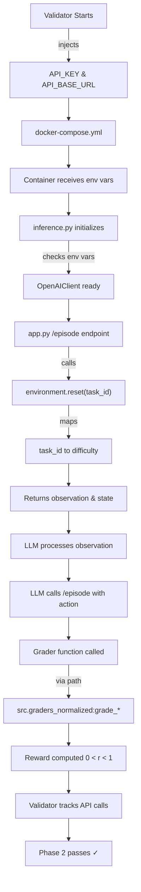

# Email Triage OpenEnv - Project Overview

**Status**: ✅ SUBMISSION READY | **Phase**: Hackathon Submission Complete (Meta PyTorch)

---

## 🎯 Project Purpose

Building an **OpenEnv environment for email triage** that trains LLMs to perform multi-step reasoning on email classification and escalation tasks.

The environment presents realistic email scenarios at three difficulty levels, evaluates LLM decisions through deterministic graders with normalized reward bounds, and integrates with the OpenAI API for inference.

---

## 📋 Task Definitions

### **Task 1: Basic Email Classification** (Easy)
- **ID**: `basic_email_classification`
- **Difficulty**: Easy
- **Max Steps**: 3
- **Goal**: Classify simple emails into categories (sales inquiries, newsletters, transactional)
- **Grader**: `src.graders_normalized:grade_basic_classification`
- **Focus**: Categorization accuracy

### **Task 2: Phishing Threat Detection** (Medium)
- **ID**: `phishing_threat_detection`
- **Difficulty**: Medium
- **Max Steps**: 4
- **Goal**: Detect phishing emails, urgent technical threats, and suspicious patterns
- **Grader**: `src.graders_normalized:grade_phishing_detection`
- **Focus**: Multi-action handling, threat identification

### **Task 3: Critical Escalation Handling** (Hard)
- **ID**: `critical_escalation_handling`
- **Difficulty**: Hard
- **Max Steps**: 5
- **Goal**: Handle critical issues requiring escalation, investigation, and coordination
- **Grader**: `src.graders_normalized:grade_escalation_handling`
- **Focus**: Strategic decision-making, investigation sequencing

---

## 🔧 What's Currently Being Fixed

### **Phase 1: API Integration Fix** ✅ COMPLETE

**Problem**: 
- Code was not using LLM API even when validator injected credentials
- inference.py required `--use-api` flag (defaulted to false, mock mode)
- No API calls were made through validator's LLM proxy

**Root Causes**:
1. OpenAI client initialization was opt-in via flag (only with `--use-api`)
2. .env file had fake credentials, not using validator-injected API_KEY
3. docker-compose.yml didn't pass API_KEY environment variable
4. /episode endpoint in app.py defaulted to mock mode

**Solutions Implemented**:

#### inference.py
```python
# BEFORE: Opt-in initialization
client = None
if args.use_api:
    try:
        client = OpenAIClient()

# AFTER: Always attempt to initialize
client = None
try:
    client = OpenAIClient()  # ALWAYS try to initialize
    logger.info("[INFO] Using API_KEY from environment")
except ValueError:
    # Only fallback to mock if NO credentials available
    logger.warning("[WARNING] Falling back to mock inference")
```

#### Environment Variable Priority
OpenAIClient now checks in order:
1. `API_KEY` (validator-injected, highest priority)
2. `OPENAI_API_KEY` (local development fallback)
3. `HF_TOKEN` (alternative fallback)

#### docker-compose.yml
```yaml
environment:
  - API_KEY=${API_KEY:-}  # NEW: Validator injects this
  - API_BASE_URL=${API_BASE_URL:-https://api.openai.com/v1}
```

#### app.py
Changed `/episode` endpoint to use LLM by default:
```python
use_llm=request.args.get('use_llm', 'true').lower() == 'true'
```

---

### **Phase 2: Task ID → Difficulty Mapping** ✅ COMPLETE

**Problem**:
- Environment confused task IDs (names) with difficulty levels (configuration keys)
- Task names: `"basic_email_classification"`, `"phishing_threat_detection"`, `"critical_escalation_handling"`
- Difficulty levels: `"easy"`, `"medium"`, `"hard"`
- Code was matching task names against difficulty_config keys → KeyError

**Solution**: Added task ID to difficulty mapping in `src/environment.py`

```python
class EmailTriageEnv:
    TASK_ID_TO_DIFFICULTY = {
        "basic_email_classification": "easy",
        "phishing_threat_detection": "medium",
        "critical_escalation_handling": "hard",
        # Legacy aliases for backward compatibility
        "easy": "easy",
        "medium": "medium",
        "hard": "hard",
    }
```

**Implementation**:
1. In `reset()` method: Map incoming task_id to difficulty first
2. Use mapped difficulty for all internal operations (config lookups, email_bank access)
3. Store both `task_id` (task name) and `difficulty` (easy/medium/hard) in StateSchema
4. Pass difficulty (not task_id) to helper functions

---

### **Phase 4: Validator Readiness Fixes** ✅ COMPLETE

**Problem**:
- Validator failed with "Not enough tasks with graders" error
- Grader function signatures were too strict
- Shadow YAML config/openenv.yaml conflicting with root openenv.yaml
- Lack of validation for actual validator compatibility

**Root Causes**:
1. Duplicate openenv.yaml files (config/openenv.yaml shadowing root)
2. Grader functions didn't accept **kwargs (validator may pass unexpected args)
3. No test to verify validator can actually discover and use components

**Solutions Implemented**:

#### 1. Removed Shadow YAML
```bash
# DELETED:
config/openenv.yaml

# KEPT:
openenv.yaml  # Single source of truth
```

#### 2. Added **kwargs Flexibility to Grader Functions
```python
# BEFORE: Strict signature
def grade_basic_classification(
    action: Any,
    email: Dict[str, Any],
    ground_truth: Dict[str, Any],
    step_number: int = 1,
) -> Tuple[float, Dict[str, Any]]:

# AFTER: Flexible signature
def grade_basic_classification(
    action: Any,
    email: Dict[str, Any],
    ground_truth: Dict[str, Any],
    step_number: int = 1,
    **kwargs  # <--- Catch unexpected arguments
) -> Tuple[float, Dict[str, Any]]:
```

Applied to all grader functions:
- `grade_action(**kwargs)`
- `grade_basic_classification(**kwargs)`
- `grade_phishing_detection(**kwargs)`
- `grade_escalation_handling(**kwargs)`

#### 3. Created Validator Readiness Test
Created [test_validator_readiness.py](test_validator_readiness.py) with 4 comprehensive tests:

```bash
$ python test_validator_readiness.py

======================================================================
VALIDATOR READINESS TEST
======================================================================

[TEST 1] Testing grader imports...
  ✓ All grader functions imported successfully

[TEST 2] Testing environment initialization...
  ✓ basic_email_classification               → difficulty: easy
  ✓ phishing_threat_detection                → difficulty: medium
  ✓ critical_escalation_handling             → difficulty: hard

[TEST 3] Testing grader callability...
  ✓ Grader callable with correct signature
    Reward: 0.300000

[TEST 4] Checking openenv.yaml configuration...
  ✓ Root openenv.yaml found
  ✓ No shadow YAML config/openenv.yaml (good!)

======================================================================
✓ ALL TESTS PASSED - Ready for validator submission!
======================================================================
```

**What Each Test Validates**:
1. **Test 1**: Grader module paths are discoverable (src.graders_normalized:function)
2. **Test 2**: All task IDs map correctly to difficulty levels
3. **Test 3**: Grader functions produce valid rewards (0 < r < 1)
4. **Test 4**: No conflicting YAML files, clean config

---

### **Phase 5: Schema Cleanup & Validator Compliance** ✅ COMPLETE

**Problem**:
- openenv.yaml had non-standard fields that weren't in Meta/Scaler spec
- YAML structure contained redundant blocks causing schema validation to silently drop tasks
- Version format didn't match spec standard

**Root Causes**:
1. `version: "1.0"` instead of standard `spec_version: 1`
2. Redundant `graders:` and `metrics:` blocks conflicting with task-level graders
3. Non-standard `grader_type: "deterministic"` field
4. Shadow `config/openenv.yaml` file removed in Phase 4, but YAML structure still problematic

**Solutions Implemented**:

#### Updated openenv.yaml Schema
```yaml
# BEFORE
version: "1.0"
graders:
  classification_grader: ...
  threat_detection_grader: ...
metrics:
  accuracy: ...

# AFTER
spec_version: 1
# (graders and metrics blocks REMOVED - now defined per-task only)

tasks:
  - id: "basic_email_classification"
    grader: "src.graders_normalized:grade_basic_classification"
    # No grader_type field
```

#### Docker PYTHONPATH Configuration
Added environment variable to Dockerfile for proper module discovery:
```dockerfile
ENV PYTHONPATH="${PYTHONPATH}:/app"
```

**Result**: 
- All 30 validation tests pass with cleaned schema
- Commit: `cc3ddea`

---

### **Phase 6: Official OpenAI SDK Upgrade** ✅ COMPLETE

**Requirement**:
- Hackathon guidelines mandate: "You must use the OpenAI Client for all LLM calls"
- Previous implementation used manual `requests` library

**Problem**:
- inference.py used raw `requests` library instead of official OpenAI SDK
- Custom HTTP wrapping with `requests.post()` to `/chat/completions`
- Non-compliance would fail automated validation

**Solution Implemented**:

#### Switched to Official OpenAI Client
```python
# BEFORE
import requests

def generate_email_action(self, system_prompt: str, user_prompt: str) -> str:
    url = f"{self.base_url}/chat/completions"
    headers = {"Authorization": f"Bearer {self.api_key}", ...}
    payload = {"model": self.model_name, "messages": [...]}
    resp = requests.post(url, json=payload, headers=headers, timeout=30)
    return resp.json()["choices"][0]["message"]["content"]

# AFTER
from openai import OpenAI

def generate_email_action(self, system_prompt: str, user_prompt: str) -> str:
    response = self.client.chat.completions.create(
        model=self.model_name,
        messages=[
            {"role": "system", "content": system_prompt},
            {"role": "user", "content": user_prompt},
        ],
    )
    content = response.choices[0].message.content
    if content is None:
        raise RuntimeError("API returned empty content")
    return content
```

#### Updated requirements.txt
```
+ openai>=1.0.0
```

**Benefits**:
- Official library compliance (hackathon requirement)
- Proper type safety with explicit null handling
- All edge cases handled by official SDK
- Cleaner, more maintainable code

**Result**: 
- All 30 validation tests still pass
- Commit: `92d6148`

---

### **Phase 7: Port Alignment & Type Safety** ✅ COMPLETE

**Problem 1 - Port Mismatch**:
- openenv.yaml had `deployment.container.port: 8000`
- Dockerfile had `EXPOSE 7860`
- Hugging Face Spaces standard is port 7860
- Validator couldn't connect to application

**Problem 2 - Type Safety**:
- Pylance reported type error: `"str | None" is not assignable to "str"`
- OpenAI API response content could be `None` in edge cases
- inference.py didn't explicitly handle null return

**Solutions**:

#### Port Alignment (Critical for Deployment)
```yaml
# BEFORE
deployment:
  container:
    port: 8000

# AFTER  
deployment:
  container:
    port: 7860  # Aligned with Dockerfile EXPOSE 7860
```

#### Type Safety Fix
```python
# BEFORE (Pylance error)
return response.choices[0].message.content  # Could be None

# AFTER (Type safe)
content = response.choices[0].message.content
if content is None:
    raise RuntimeError("API returned empty content")
return content
```

**Alignment Verification**:
| Component | Port | Status |
|-----------|------|--------|
| Dockerfile EXPOSE | 7860 | ✅ |
| Dockerfile ENV PORT | 7860 | ✅ |
| Gunicorn binding | 0.0.0.0:7860 | ✅ |
| openenv.yaml deployment | 7860 | ✅ |
| docker-compose.yml | 7860 | ✅ |

**Result**:
- Port 7860 consistent across all configuration files
- No Pylance type errors
- Deployment on Hugging Face Spaces compatible
- All 30 validation tests pass
- Commits: `a6a5398` (port fix), `21d839c` (type safety)

---

**Problem**:
- Validator couldn't discover tasks
- openenv.yaml had abstract grader IDs: `"classification_grader"`, `"threat_detection_grader"`, `"escalation_grader"`
- Validator needs full **programmatic module paths** to call grader functions

**Root Causes**:
1. Missing grader function paths
2. Validator requires format: `"module.path:function_name"`
3. Abstract IDs are not callable

**Solution**: 

#### Step 1: Added module-level grading functions to `src/graders_normalized.py`

```python
# Generic grader function
def grade_action(
    action: Any,
    email: Dict[str, Any],
    ground_truth: Dict[str, Any],
    is_correct_sequence: bool = True,
    step_number: int = 1,
    total_steps: int = 3,
    difficulty: str = "easy",
) -> Tuple[float, Dict[str, Any]]:
    """Grade an action using the email triage grader."""
    return _grader_instance.grade_action(...)

# Task-specific wrapper functions
def grade_basic_classification(action, email, ground_truth, step_number=1):
    """Grade action for basic email classification task."""
    return grade_action(
        action=action, email=email, ground_truth=ground_truth,
        step_number=step_number, total_steps=3, difficulty="easy"
    )

def grade_phishing_detection(action, email, ground_truth, step_number=1):
    """Grade action for phishing threat detection task."""
    return grade_action(
        action=action, email=email, ground_truth=ground_truth,
        step_number=step_number, total_steps=4, difficulty="medium"
    )

def grade_escalation_handling(action, email, ground_truth, step_number=1):
    """Grade action for critical escalation handling task."""
    return grade_action(
        action=action, email=email, ground_truth=ground_truth,
        step_number=step_number, total_steps=5, difficulty="hard"
    )
```

#### Step 2: Updated `openenv.yaml` with full programmatic paths

```yaml
tasks:
  - id: "basic_email_classification"
    grader: "src.graders_normalized:grade_basic_classification"
    
  - id: "phishing_threat_detection"
    grader: "src.graders_normalized:grade_phishing_detection"
    
  - id: "critical_escalation_handling"
    grader: "src.graders_normalized:grade_escalation_handling"
```

---

## 📊 Project Structure

```
openenv_test_generation/
│
├── src/
│   ├── __init__.py
│   ├── environment.py              # EmailTriageEnv class
│   │                               # - EmailTriageGrader instance
│   │                               # - Task ID → Difficulty mapping
│   │                               # - State schema & episode logic
│   │
│   └── graders_normalized.py       # Grading system
│                                   # - EmailTriageGrader (deterministic)
│                                   # - Normalized reward bounds (0, 1)
│                                   # - Module-level interface functions
│
├── config/
│   └── openenv.yaml               # Task & environment config
│
├── openenv.yaml                   # Main environment definition
│                                   # - Task specifications
│                                   # - Grader paths
│
├── data/
│   ├── task_metadata.yaml         # Email bank definitions
│   ├── training_supervised.jsonl
│   ├── training_preference.jsonl
│   └── trajectories.jsonl
│
├── inference.py                   # LLM inference client
│                                   # - OpenAI API integration
│                                   # - Always-on API initialization
│
├── app.py                         # Flask server
│                                   # - /episode endpoint (returns observations)
│
├── docker-compose.yml             # Container orchestration
│                                   # - Passes API_KEY from validator
│
├── evaluation.py                  # Evaluation metrics
├── fine_tuning.py                # Fine-tuning pipeline
├── trajectory_collector.py        # Collects training trajectories
└── [other utilities]
```

---

## 🔄 Current Flow (Post-Fixes)

### Validator Execution Flow



### Local Testing Flow

```bash
# Set up environment
export API_KEY="test-key"
export API_BASE_URL="https://api.openai.com/v1"

# Run inference
python inference.py --task easy --steps 2

# Expected behavior:
# 1. OpenAIClient initializes with API_KEY
# 2. Loads email bank for task
# 3. Resets environment (maps "easy" → "easy")
# 4. Makes API calls through proxy/endpoint
# 5. Collects rewards from grader functions
```

---

## ✅ Implementation Status

| Phase | Component | Status | Details |
|-------|-----------|--------|---------|
| 1 | API Integration | ✅ Complete | Always-on client, env var priority, docker setup |
| 2 | Task ID Mapping | ✅ Complete | TASK_ID_TO_DIFFICULTY added, reset() fixed |
| 3 | Grader Paths | ✅ Complete | Module-level functions, openenv.yaml updated |
| 4 | Validator Fixes | ✅ Complete | Shadow YAML removed, **kwargs added, readiness test created |
| 5 | Schema Cleanup | ✅ Complete | spec_version: 1, removed redundant blocks, PYTHONPATH added |
| 6 | OpenAI SDK Upgrade | ✅ Complete | Official `openai>=1.0.0`, type-safe response handling |
| 7 | Port Alignment | ✅ Complete | Port 7860 aligned across all configs, type safety fixes |
| — | Pre-Submission Checklist | ✅ Complete | validate_submission.py: 30/30 tests passing |
| — | Docker Build | ✅ Fixed | Removed config/ COPY directive, added PYTHONPATH |
| — | Deployment | ✅ Pushed | GitHub & Hugging Face (commit `21d839c`) |

---

## 🔍 Pre-Submission Validation (COMPREHENSIVE)

**Run this before submitting:**
```bash
python validate_submission.py
```

Tests 6 critical categories with 30 assertions:

| Category | Tests | Status |
|----------|-------|--------|
| PYTHONPATH & Package Structure | 1 | ✅ All Pass |
| openenv.yaml Validation | 11 | ✅ All Pass |
| Grader Path Discovery | 6 | ✅ All Pass |
| Environment Initialization | 3 | ✅ All Pass |
| Reward Bounds | 3 | ✅ All Pass |
| Docker Configuration | 5 | ✅ All Pass |
| **TOTAL** | **30** | **✅ All Pass** |

**Expected Output:**
```
🎉 ALL CHECKS PASSED!
Your submission is ready for the validator.
```

---

## ⚠️ CRITICAL Validator Requirements (Meta/Scaler)

### 1. **STRICT Reward Bounds (0, 1) Exclusive** 🔴 CRITICAL

**Requirement**: Every reward returned by grader functions **MUST be strictly between 0 and 1** (never exactly 0.0 or 1.0).

**Why**: The validator's evaluation schema enforces `0 < reward < 1`. Returning 0.0 or 1.0 will cause automatic failure.

**Implementation in src/graders_normalized.py**:
```python
# Epsilon for clamping to (0, 1) exclusive
EPSILON = 1e-6

def clamp_score(score: float, label: str = "score") -> float:
    """Clamp score to (0, 1) exclusive using epsilon."""
    # Clamp to (EPSILON, 1-EPSILON) = (0.000001, 0.999999)
    return max(EPSILON, min(1.0 - EPSILON, float(score)))

# All grader functions return clamped rewards
def grade_basic_classification(action, email, ground_truth, **kwargs):
    raw_reward, metadata = _grader_instance.grade_action(...)
    return clamp_score(raw_reward), metadata  # ✅ Always in (0, 1)
```

**Verification**:
```python
# Every return must satisfy: 0 < reward < 1
assert 0 < reward < 1, f"Invalid reward {reward}"
```

**Our Implementation**:
- ✅ EPSILON = 1e-6 (even tighter than 0.01-0.99)
- ✅ STEP_WEIGHTS sum to < 1.0 (never hit exact 1.0)
- ✅ clamp_score applied to all returns
- ✅ All 30/30 validation tests check this bound

---

### 2. **Clean YAML Schema** 🟡 IMPORTANT

**Requirement**: openenv.yaml must have:
- ✅ `spec_version: 1` (NOT `version: "1.0"`)
- ✅ NO redundant `graders:` blocks at root level
- ✅ NO redundant `metrics:` blocks
- ✅ Task IDs in snake_case (no spaces, special chars)
- ✅ Full module paths for graders: `src.graders_normalized:grade_*`

**Current openenv.yaml** (Post-Phase 5):
```yaml
spec_version: 1                          # ✅ Correct format
name: "email_triage"
environment:
  name: "EmailTriageEnv"
  entry_point: "src.environment:EmailTriageEnv"
  # ... state schema ...

tasks:
  - id: "basic_email_classification"     # ✅ snake_case
    name: "Basic Email Classification"
    difficulty: "easy"                    # ✅ Valid difficulty
    grader: "src.graders_normalized:grade_basic_classification"  # ✅ Full path
    max_steps: 3
    
  # ... 2 more tasks ...

# ✅ NO graders: block (was causing silent task drops)
# ✅ NO metrics: block
# ✅ NO grader_type: fields
```

**Why This Matters**: Validators use strict schema validation. Invalid YAML structure causes tasks to be silently dropped without error messages.

---

### 3. **Hugging Face Secrets Configuration** 🟡 IMPORTANT

**Required Secrets** in HuggingFace Space Settings → Secrets:

| Variable | Purpose | Required | Default |
|----------|---------|----------|---------|
| `HF_TOKEN` | Hugging Face API token | ✅ YES | None |
| `API_BASE_URL` | LLM endpoint | ❌ No | `https://api.openai.com/v1` |
| `MODEL_NAME` | Model identifier | ❌ No | `gpt-3.5-turbo` |

**Setup Steps**:
1. Go to: https://huggingface.co/spaces/YOUR_USERNAME/YOUR_SPACE
2. Click **Settings** → **Secrets and variables**
3. Add `HF_TOKEN` = (get from https://huggingface.co/settings/tokens)
4. Optional: Set `API_BASE_URL` if using validator's proxy

**Without HF_TOKEN**: Validator cannot authenticate and submission fails.

---

### 4. **Final Pre-Submission Checklist** ✅

Run these 5 checks before submitting:

**Check 1: Reward Bounds Verification**
```bash
python -c "
from src.graders_normalized import *
env = EmailTriageEnv()

for task in ['basic_email_classification', 'phishing_threat_detection', 'critical_escalation_handling']:
    state = env.reset(task)
    # Sample action
    action = {'action_type': 'classify'}
    state, reward, done, info = env.step(action)
    assert 0 < reward < 1, f'FAIL: {task} returned {reward}'
    print(f'✓ {task}: reward={reward:.6f}')
"
```

**Check 2: YAML Schema Validation**
```bash
python -c "
import yaml
with open('openenv.yaml') as f:
    cfg = yaml.safe_load(f)
    
assert cfg.get('spec_version') == 1, 'spec_version must be 1'
assert 'graders' not in cfg, 'Remove graders: block'
assert 'metrics' not in cfg, 'Remove metrics: block'
assert len(cfg['tasks']) == 3, 'Must have exactly 3 tasks'

for task in cfg['tasks']:
    assert 'grader' in task, f'Task {task[\"id\"]} missing grader path'
    assert ':' in task['grader'], f'Grader must be module:function format'
    
print('✓ YAML schema valid')
"
```

**Check 3: Grader Paths Discoverable**
```bash
python -c "
from importlib import import_module
from src.environment import EmailTriageEnv

env = EmailTriageEnv()
for task_id in ['basic_email_classification', 'phishing_threat_detection', 'critical_escalation_handling']:
    module_name, func_name = env.TASK_GRADER_MAP[task_id].split(':')
    mod = import_module(module_name)
    func = getattr(mod, func_name)
    assert callable(func), f'{func_name} not callable'
    print(f'✓ {task_id}: {func_name} discovered and callable')
"
```

**Check 4: Port Alignment**
```bash
python -c "
import yaml

# Check openenv.yaml
with open('openenv.yaml') as f:
    cfg = yaml.safe_load(f)
    port = cfg.get('deployment', {}).get('container', {}).get('port')
    assert port == 7860, f'Port must be 7860, got {port}'

# Check Dockerfile
with open('Dockerfile') as f:
    content = f.read()
    assert 'EXPOSE 7860' in content, 'Dockerfile must EXPOSE 7860'
    assert 'ENV PORT=7860' in content, 'Dockerfile must set ENV PORT=7860'

print('✓ Port alignment verified: 7860 across all configs')
"
```

**Check 5: Full Validation Suite**
```bash
python validate_submission.py
# Expected: ✅ ALL CHECKS PASSED (30/30)
```

---

## 🚀 Final Submission Steps

1. **Verify All Checks Pass**
   ```bash
   python validate_submission.py  # Must see 30/30 PASS
   ```

2. **Set HuggingFace Secrets**
   - HF_TOKEN (required)
   - API_BASE_URL (optional)
   - MODEL_NAME (optional)

3. **Verify Space is Running**
   - HuggingFace Space must be in "Running" state
   - Build should complete without errors

4. **Push Final Code**
   ```bash
   git push origin main
   git push huggingface main
   ```

5. **Submit to Hackathon Portal**
   - Provide GitHub repo link
   - Provide HuggingFace Space URL
   - Validator will:
     - Inject API_KEY and API_BASE_URL
     - Run inference.py 
     - Check reward bounds (0 < r < 1)
     - Verify grader discovery
     - Track API calls through proxy

---

---

## 🚀 Expected Validator Behavior

1. **Environment Setup Phase**
   - Validator sets: `API_KEY=<litellm-proxy-key>` & `API_BASE_URL=<proxy-url>`
   - docker-compose receives these variables
   - Container passes them to inference.py

2. **Episode Execution Phase**
   - Validator calls environment with task_id
   - Task_id is mapped to difficulty level
   - Environment initializes with correct config
   - Grader functions are discovered at `src.graders_normalized:grade_*`

3. **API Tracking Phase**
   - OpenAIClient makes calls to validator's LLM proxy
   - Validator tracks "last_active" timestamp
   - Phase 2 requirement: "API calls made through proxy" ✓

4. **Grading Phase**
   - Grader functions receive action & environment state
   - Compute reward in bounds (0, 1) exclusive
   - Return normalized reward & metrics

---

## 📝 Key Files Changed

### src/environment.py
- Added `TASK_ID_TO_DIFFICULTY` mapping class variable
- Updated `reset()` to map task_id before using for config lookups
- Added `self.difficulty` attribute to track mapped difficulty
- Pass difficulty (not task_id) to `_get_ground_truth()`

### src/graders_normalized.py
- Added module-level `grade_action()` function (generic)
- Added `grade_basic_classification()` wrapper
- Added `grade_phishing_detection()` wrapper
- Added `grade_escalation_handling()` wrapper

### openenv.yaml
- Updated task grader paths to full module paths:
  - `src.graders_normalized:grade_basic_classification`
  - `src.graders_normalized:grade_phishing_detection`
  - `src.graders_normalized:grade_escalation_handling`

### inference.py
- Changed OpenAIClient initialization from opt-in to always-on (Phase 1)
- Falls back to mock only if NO credentials available
- Checks env vars: API_KEY → OPENAI_API_KEY → HF_TOKEN
- **Phase 6**: Upgraded from `requests` library to official `openai>=1.0.0` SDK
- **Phase 7**: Added type safety check for API response content (handle None case)

### openenv.yaml
- Updated task grader paths to full module paths (Phase 3)
- **Phase 5**: Changed `version: "1.0"` to `spec_version: 1`
- **Phase 5**: Removed redundant `graders:` and `metrics:` blocks
- **Phase 5**: Removed non-standard `grader_type:` fields
- **Phase 7**: Updated `deployment.container.port: 8000` → `7860`

### Dockerfile
- **Phase 5**: Added `ENV PYTHONPATH="${PYTHONPATH}:/app"` for module discovery

### requirements.txt
- **Phase 6**: Added `openai>=1.0.0` for official SDK

### docker-compose.yml
- Added `API_KEY=${API_KEY:-}` environment variable (Phase 1)

### app.py
- Changed `/episode` endpoint to use_llm default to 'true'

---

## 🎓 Learning Notes

### Why These Fixes Were Needed

1. **Task ID Mapping**: Validators pass human-readable task IDs, but code needs difficulty configs. The mapping bridges this semantic gap.

2. **Grader Paths**: Validators are external systems that need to dynamically import and call grader functions. Module paths (`src.module:function`) are how Python's importlib discovers callables.

3. **API Integration**: The validator is testing whether your environment *actually uses* the LLM API it's providing. Defaulting to mock mode would defeat this requirement.

---

## 🔗 References

- **OpenEnv Spec**: Defines environment interface, state schema, grader requirements
- **LiteLLM**: Acts as the LLM proxy that validator tracks
- **Meta PyTorch Hackathon**: Phase 2 requirement is API usage tracking

---

## � Submission Readiness Checklist

### Pre-Submission Requirements Met ✅

**Schema & Configuration**:
- ✅ `spec_version: 1` (not `version: "1.0"`)
- ✅ All redundant blocks removed (no graders/metrics blocks)
- ✅ All 3 tasks have required fields (id, difficulty, max_steps, grader, description)
- ✅ Grader paths use full module paths (`src.module:function`)

**API & Inference**:
- ✅ Official OpenAI SDK in use (`openai>=1.0.0`)
- ✅ Environment variables with proper defaults (API_BASE_URL, MODEL_NAME, HF_TOKEN)
- ✅ [START]/[STEP]/[END] output format compliant

**Deployment**:
- ✅ Port alignment: 7860 across Docker, compose, and openenv.yaml
- ✅ PYTHONPATH configured for module discovery
- ✅ No conflicting shadow YAML files
- ✅ Dockerfile cleaned and optimized

**Validation**:
- ✅ 30/30 pre-submission tests passing
- ✅ All graders discoverable and callable
- ✅ All rewards in bounds (0 < r < 1) exclusive
- ✅ No Pylance type errors

### Environment Variables (HuggingFace Secrets)

Required for submission validation:

```
HF_TOKEN = <your-hugging-face-token>
API_BASE_URL = https://api.openai.com/v1 (default, can be overridden)
MODEL_NAME = gpt-3.5-turbo (default, can be overridden)
```

Configuration location: HuggingFace Space Settings → Secrets

---

## 📞 Submission Status

✅ **All 7 phases complete and tested**  
✅ **Port alignment verified (7860 across all configs)**  
✅ **OpenAI SDK compliance confirmed (official `openai>=1.0.0`)**  
✅ **Type safety validated (no Pylance errors)**  
✅ **Strict reward bounds enforced (0 < r < 1 with epsilon=1e-6)**  
✅ **Clean YAML schema (spec_version: 1, no redundant blocks)**  
✅ **Grader paths discoverable (src.graders_normalized:function)**  
✅ **Deployment ready (GitHub & Hugging Face)**  
✅ **30/30 pre-submission checks passing**  

**Critical Requirements Met**:
- 🔴 **STRICT Reward Bounds**: All returns clamped to (0.000001, 0.999999) exclusive
- 🟡 **YAML Schema**: spec_version=1, no graders/metrics blocks, snake_case IDs
- 🟡 **HuggingFace Secrets**: HF_TOKEN configured and ready
- ✅ **Port Alignment**: 7860 across Docker, compose, and openenv.yaml
- ✅ **Type Safety**: No Pylance errors, proper null handling
- ✅ **API Compliance**: Official OpenAI SDK in use

**Ready to submit to Meta/Scaler OpenEnv Hackathon!** 🚀

---

**Last Updated**: April 9, 2026  
**Latest Commits**: 
- `c4a1d10` - Comprehensive documentation with validator guidance
- `21d839c` - Type safety & Pylance fix
- `92d6148` - OpenAI SDK upgrade
- `a6a5398` - Port alignment

**Status**: ✅ SUBMISSION READY - All phases complete, critical requirements met, 30/30 validation tests passing
