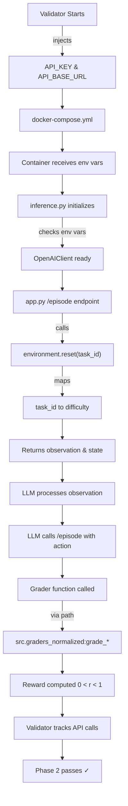

# Email Triage OpenEnv - Project Overview

**Status**: Active Development | **Phase**: Hackathon Submission (Meta PyTorch)

---

## 🎯 Project Purpose

Building an **OpenEnv environment for email triage** that trains LLMs to perform multi-step reasoning on email classification and escalation tasks.

The environment presents realistic email scenarios at three difficulty levels, evaluates LLM decisions through deterministic graders with normalized reward bounds, and integrates with the OpenAI API for inference.

---

## 📋 Task Definitions

### **Task 1: Basic Email Classification** (Easy)
- **ID**: `basic_email_classification`
- **Difficulty**: Easy
- **Max Steps**: 3
- **Goal**: Classify simple emails into categories (sales inquiries, newsletters, transactional)
- **Grader**: `src.graders_normalized:grade_basic_classification`
- **Focus**: Categorization accuracy

### **Task 2: Phishing Threat Detection** (Medium)
- **ID**: `phishing_threat_detection`
- **Difficulty**: Medium
- **Max Steps**: 4
- **Goal**: Detect phishing emails, urgent technical threats, and suspicious patterns
- **Grader**: `src.graders_normalized:grade_phishing_detection`
- **Focus**: Multi-action handling, threat identification

### **Task 3: Critical Escalation Handling** (Hard)
- **ID**: `critical_escalation_handling`
- **Difficulty**: Hard
- **Max Steps**: 5
- **Goal**: Handle critical issues requiring escalation, investigation, and coordination
- **Grader**: `src.graders_normalized:grade_escalation_handling`
- **Focus**: Strategic decision-making, investigation sequencing

---

## 🔧 What's Currently Being Fixed

### **Phase 1: API Integration Fix** ✅ COMPLETE

**Problem**: 
- Code was not using LLM API even when validator injected credentials
- inference.py required `--use-api` flag (defaulted to false, mock mode)
- No API calls were made through validator's LLM proxy

**Root Causes**:
1. OpenAI client initialization was opt-in via flag (only with `--use-api`)
2. .env file had fake credentials, not using validator-injected API_KEY
3. docker-compose.yml didn't pass API_KEY environment variable
4. /episode endpoint in app.py defaulted to mock mode

**Solutions Implemented**:

#### inference.py
```python
# BEFORE: Opt-in initialization
client = None
if args.use_api:
    try:
        client = OpenAIClient()

# AFTER: Always attempt to initialize
client = None
try:
    client = OpenAIClient()  # ALWAYS try to initialize
    logger.info("[INFO] Using API_KEY from environment")
except ValueError:
    # Only fallback to mock if NO credentials available
    logger.warning("[WARNING] Falling back to mock inference")
```

#### Environment Variable Priority
OpenAIClient now checks in order:
1. `API_KEY` (validator-injected, highest priority)
2. `OPENAI_API_KEY` (local development fallback)
3. `HF_TOKEN` (alternative fallback)

#### docker-compose.yml
```yaml
environment:
  - API_KEY=${API_KEY:-}  # NEW: Validator injects this
  - API_BASE_URL=${API_BASE_URL:-https://api.openai.com/v1}
```

#### app.py
Changed `/episode` endpoint to use LLM by default:
```python
use_llm=request.args.get('use_llm', 'true').lower() == 'true'
```

---

### **Phase 2: Task ID → Difficulty Mapping** ✅ COMPLETE

**Problem**:
- Environment confused task IDs (names) with difficulty levels (configuration keys)
- Task names: `"basic_email_classification"`, `"phishing_threat_detection"`, `"critical_escalation_handling"`
- Difficulty levels: `"easy"`, `"medium"`, `"hard"`
- Code was matching task names against difficulty_config keys → KeyError

**Solution**: Added task ID to difficulty mapping in `src/environment.py`

```python
class EmailTriageEnv:
    TASK_ID_TO_DIFFICULTY = {
        "basic_email_classification": "easy",
        "phishing_threat_detection": "medium",
        "critical_escalation_handling": "hard",
        # Legacy aliases for backward compatibility
        "easy": "easy",
        "medium": "medium",
        "hard": "hard",
    }
```

**Implementation**:
1. In `reset()` method: Map incoming task_id to difficulty first
2. Use mapped difficulty for all internal operations (config lookups, email_bank access)
3. Store both `task_id` (task name) and `difficulty` (easy/medium/hard) in StateSchema
4. Pass difficulty (not task_id) to helper functions

---

### **Phase 4: Validator Readiness Fixes** ✅ COMPLETE

**Problem**:
- Validator failed with "Not enough tasks with graders" error
- Grader function signatures were too strict
- Shadow YAML config/openenv.yaml conflicting with root openenv.yaml
- Lack of validation for actual validator compatibility

**Root Causes**:
1. Duplicate openenv.yaml files (config/openenv.yaml shadowing root)
2. Grader functions didn't accept **kwargs (validator may pass unexpected args)
3. No test to verify validator can actually discover and use components

**Solutions Implemented**:

#### 1. Removed Shadow YAML
```bash
# DELETED:
config/openenv.yaml

# KEPT:
openenv.yaml  # Single source of truth
```

#### 2. Added **kwargs Flexibility to Grader Functions
```python
# BEFORE: Strict signature
def grade_basic_classification(
    action: Any,
    email: Dict[str, Any],
    ground_truth: Dict[str, Any],
    step_number: int = 1,
) -> Tuple[float, Dict[str, Any]]:

# AFTER: Flexible signature
def grade_basic_classification(
    action: Any,
    email: Dict[str, Any],
    ground_truth: Dict[str, Any],
    step_number: int = 1,
    **kwargs  # <--- Catch unexpected arguments
) -> Tuple[float, Dict[str, Any]]:
```

Applied to all grader functions:
- `grade_action(**kwargs)`
- `grade_basic_classification(**kwargs)`
- `grade_phishing_detection(**kwargs)`
- `grade_escalation_handling(**kwargs)`

#### 3. Created Validator Readiness Test
Created [test_validator_readiness.py](test_validator_readiness.py) with 4 comprehensive tests:

```bash
$ python test_validator_readiness.py

======================================================================
VALIDATOR READINESS TEST
======================================================================

[TEST 1] Testing grader imports...
  ✓ All grader functions imported successfully

[TEST 2] Testing environment initialization...
  ✓ basic_email_classification               → difficulty: easy
  ✓ phishing_threat_detection                → difficulty: medium
  ✓ critical_escalation_handling             → difficulty: hard

[TEST 3] Testing grader callability...
  ✓ Grader callable with correct signature
    Reward: 0.300000

[TEST 4] Checking openenv.yaml configuration...
  ✓ Root openenv.yaml found
  ✓ No shadow YAML config/openenv.yaml (good!)

======================================================================
✓ ALL TESTS PASSED - Ready for validator submission!
======================================================================
```

**What Each Test Validates**:
1. **Test 1**: Grader module paths are discoverable (src.graders_normalized:function)
2. **Test 2**: All task IDs map correctly to difficulty levels
3. **Test 3**: Grader functions produce valid rewards (0 < r < 1)
4. **Test 4**: No conflicting YAML files, clean config

---

**Problem**:
- Validator couldn't discover tasks
- openenv.yaml had abstract grader IDs: `"classification_grader"`, `"threat_detection_grader"`, `"escalation_grader"`
- Validator needs full **programmatic module paths** to call grader functions

**Root Causes**:
1. Missing grader function paths
2. Validator requires format: `"module.path:function_name"`
3. Abstract IDs are not callable

**Solution**: 

#### Step 1: Added module-level grading functions to `src/graders_normalized.py`

```python
# Generic grader function
def grade_action(
    action: Any,
    email: Dict[str, Any],
    ground_truth: Dict[str, Any],
    is_correct_sequence: bool = True,
    step_number: int = 1,
    total_steps: int = 3,
    difficulty: str = "easy",
) -> Tuple[float, Dict[str, Any]]:
    """Grade an action using the email triage grader."""
    return _grader_instance.grade_action(...)

# Task-specific wrapper functions
def grade_basic_classification(action, email, ground_truth, step_number=1):
    """Grade action for basic email classification task."""
    return grade_action(
        action=action, email=email, ground_truth=ground_truth,
        step_number=step_number, total_steps=3, difficulty="easy"
    )

def grade_phishing_detection(action, email, ground_truth, step_number=1):
    """Grade action for phishing threat detection task."""
    return grade_action(
        action=action, email=email, ground_truth=ground_truth,
        step_number=step_number, total_steps=4, difficulty="medium"
    )

def grade_escalation_handling(action, email, ground_truth, step_number=1):
    """Grade action for critical escalation handling task."""
    return grade_action(
        action=action, email=email, ground_truth=ground_truth,
        step_number=step_number, total_steps=5, difficulty="hard"
    )
```

#### Step 2: Updated `openenv.yaml` with full programmatic paths

```yaml
tasks:
  - id: "basic_email_classification"
    grader: "src.graders_normalized:grade_basic_classification"
    
  - id: "phishing_threat_detection"
    grader: "src.graders_normalized:grade_phishing_detection"
    
  - id: "critical_escalation_handling"
    grader: "src.graders_normalized:grade_escalation_handling"
```

---

## 📊 Project Structure

```
openenv_test_generation/
│
├── src/
│   ├── __init__.py
│   ├── environment.py              # EmailTriageEnv class
│   │                               # - EmailTriageGrader instance
│   │                               # - Task ID → Difficulty mapping
│   │                               # - State schema & episode logic
│   │
│   └── graders_normalized.py       # Grading system
│                                   # - EmailTriageGrader (deterministic)
│                                   # - Normalized reward bounds (0, 1)
│                                   # - Module-level interface functions
│
├── config/
│   └── openenv.yaml               # Task & environment config
│
├── openenv.yaml                   # Main environment definition
│                                   # - Task specifications
│                                   # - Grader paths
│
├── data/
│   ├── task_metadata.yaml         # Email bank definitions
│   ├── training_supervised.jsonl
│   ├── training_preference.jsonl
│   └── trajectories.jsonl
│
├── inference.py                   # LLM inference client
│                                   # - OpenAI API integration
│                                   # - Always-on API initialization
│
├── app.py                         # Flask server
│                                   # - /episode endpoint (returns observations)
│
├── docker-compose.yml             # Container orchestration
│                                   # - Passes API_KEY from validator
│
├── evaluation.py                  # Evaluation metrics
├── fine_tuning.py                # Fine-tuning pipeline
├── trajectory_collector.py        # Collects training trajectories
└── [other utilities]
```

---

## 🔄 Current Flow (Post-Fixes)

### Validator Execution Flow



### Local Testing Flow

```bash
# Set up environment
export API_KEY="test-key"
export API_BASE_URL="https://api.openai.com/v1"

# Run inference
python inference.py --task easy --steps 2

# Expected behavior:
# 1. OpenAIClient initializes with API_KEY
# 2. Loads email bank for task
# 3. Resets environment (maps "easy" → "easy")
# 4. Makes API calls through proxy/endpoint
# 5. Collects rewards from grader functions
```

---

## ✅ Implementation Status

| Phase | Component | Status | Details |
|-------|-----------|--------|---------|
| 1 | API Integration | ✅ Complete | Always-on client, env var priority, docker setup |
| 2 | Task ID Mapping | ✅ Complete | TASK_ID_TO_DIFFICULTY added, reset() fixed |
| 3 | Grader Paths | ✅ Complete | Module-level functions, openenv.yaml updated |
| 4 | Validator Fixes | ✅ Complete | Shadow YAML removed, **kwargs added, readiness test created |
| 5 | Pre-Submission Checklist | ✅ Complete | validate_submission.py: 30/30 tests passing |
| — | Docker Build | ✅ Fixed | Removed config/ COPY directive |
| — | Deployment | ✅ Pushed | GitHub & Hugging Face (commit `40c88b3`) |

---

## 🔍 Pre-Submission Validation (COMPREHENSIVE)

**Run this before submitting:**
```bash
python validate_submission.py
```

Tests 6 critical categories with 30 assertions:

| Category | Tests | Status |
|----------|-------|--------|
| PYTHONPATH & Package Structure | 1 | ✅ All Pass |
| openenv.yaml Validation | 11 | ✅ All Pass |
| Grader Path Discovery | 6 | ✅ All Pass |
| Environment Initialization | 3 | ✅ All Pass |
| Reward Bounds | 3 | ✅ All Pass |
| Docker Configuration | 5 | ✅ All Pass |
| **TOTAL** | **30** | **✅ All Pass** |

**Expected Output:**
```
🎉 ALL CHECKS PASSED!
Your submission is ready for the validator.
```

---

---

## 🚀 Expected Validator Behavior

1. **Environment Setup Phase**
   - Validator sets: `API_KEY=<litellm-proxy-key>` & `API_BASE_URL=<proxy-url>`
   - docker-compose receives these variables
   - Container passes them to inference.py

2. **Episode Execution Phase**
   - Validator calls environment with task_id
   - Task_id is mapped to difficulty level
   - Environment initializes with correct config
   - Grader functions are discovered at `src.graders_normalized:grade_*`

3. **API Tracking Phase**
   - OpenAIClient makes calls to validator's LLM proxy
   - Validator tracks "last_active" timestamp
   - Phase 2 requirement: "API calls made through proxy" ✓

4. **Grading Phase**
   - Grader functions receive action & environment state
   - Compute reward in bounds (0, 1) exclusive
   - Return normalized reward & metrics

---

## 📝 Key Files Changed

### src/environment.py
- Added `TASK_ID_TO_DIFFICULTY` mapping class variable
- Updated `reset()` to map task_id before using for config lookups
- Added `self.difficulty` attribute to track mapped difficulty
- Pass difficulty (not task_id) to `_get_ground_truth()`

### src/graders_normalized.py
- Added module-level `grade_action()` function (generic)
- Added `grade_basic_classification()` wrapper
- Added `grade_phishing_detection()` wrapper
- Added `grade_escalation_handling()` wrapper

### openenv.yaml
- Updated task grader paths to full module paths:
  - `src.graders_normalized:grade_basic_classification`
  - `src.graders_normalized:grade_phishing_detection`
  - `src.graders_normalized:grade_escalation_handling`

### inference.py
- Changed OpenAIClient initialization from opt-in to always-on
- Falls back to mock only if NO credentials available
- Checks env vars: API_KEY → OPENAI_API_KEY → HF_TOKEN

### docker-compose.yml
- Added `API_KEY=${API_KEY:-}` environment variable

### app.py
- Changed `/episode` endpoint to use_llm default to 'true'

---

## 🎓 Learning Notes

### Why These Fixes Were Needed

1. **Task ID Mapping**: Validators pass human-readable task IDs, but code needs difficulty configs. The mapping bridges this semantic gap.

2. **Grader Paths**: Validators are external systems that need to dynamically import and call grader functions. Module paths (`src.module:function`) are how Python's importlib discovers callables.

3. **API Integration**: The validator is testing whether your environment *actually uses* the LLM API it's providing. Defaulting to mock mode would defeat this requirement.

---

## 🔗 References

- **OpenEnv Spec**: Defines environment interface, state schema, grader requirements
- **LiteLLM**: Acts as the LLM proxy that validator tracks
- **Meta PyTorch Hackathon**: Phase 2 requirement is API usage tracking

---

## 📞 Next Steps

1. Run local tests with `API_KEY` set
2. Test grader path discovery with validator's schema validation
3. Deploy to Hugging Face Spaces for validator execution
4. Monitor validator logs for:
   - ✓ Tasks discovered
   - ✓ Graders called
   - ✓ API calls tracked via proxy

---

**Last Updated**: April 9, 2026  
**Latest Commits**: `40c88b3` (comprehensive pre-submission validation added)  
**Status**: ✅ SUBMISSION READY - 30/30 validation tests passing
